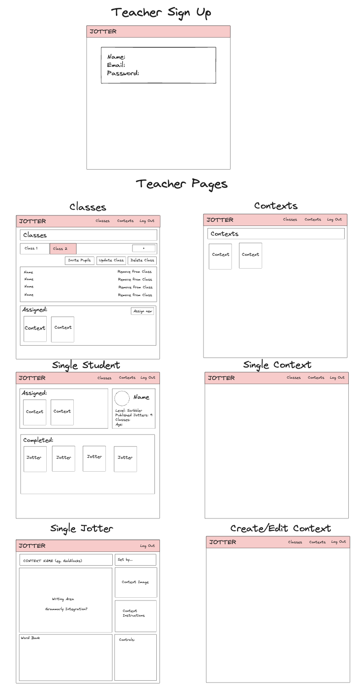
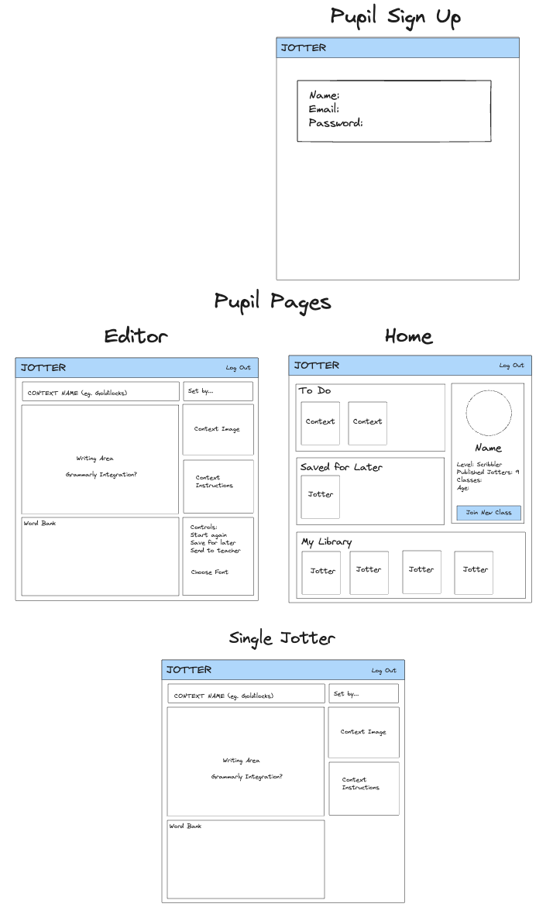
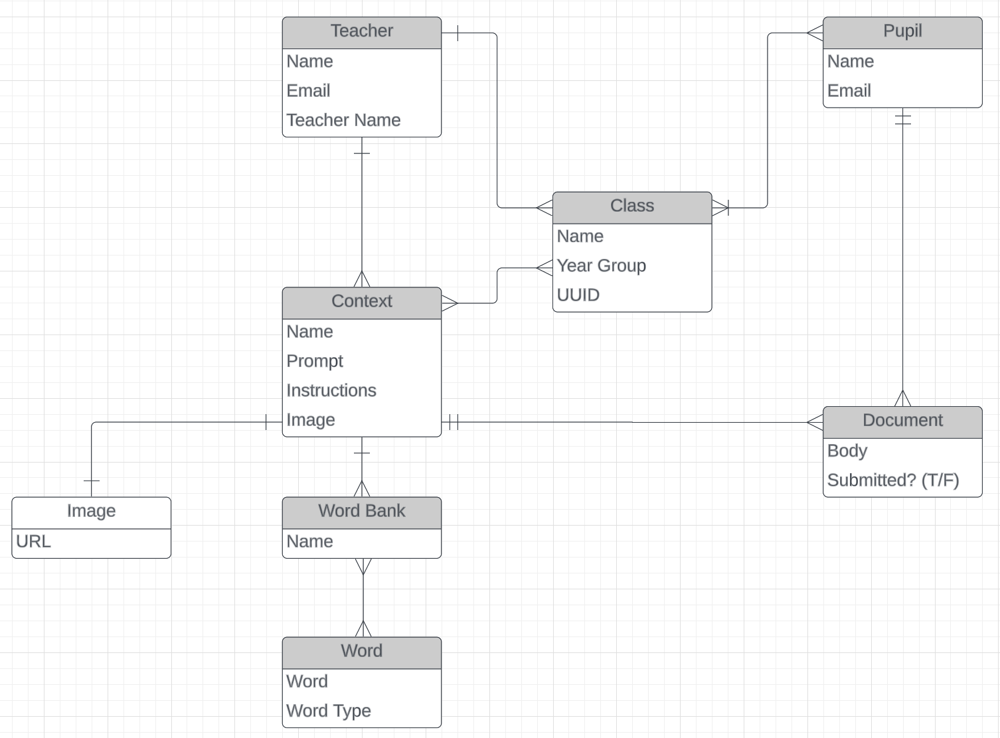

# Project 4: Jotter ReadMe

## Description

Jotter is my final General Assembly Software Engineering Immersive Course project, completed at the end of the final unit of the course - which focused on Python and Django. As such, the project is built with a Django Rest Framework back end and a React front end.

## Deployment link

**[https://jotter.up.railway.app/](https://jotter.up.railway.app/)**	

## Getting Started/Code Installation

The front-end code is accessible through this repo: [https://github.com/thstanton/project4-frontend](https://github.com/thstanton/project4-frontend)
Run ``npm install`` to install dependencies
Run ``npm start`` to start local server

The back-end code is accessible through this repo:

[https://github.com/thstanton/project4-backend](https://github.com/thstanton/project4-backend)
Run ``pip install -r requirements.txt`` to install dependencies
Run ``python3 manage.py runserver`` to start local server

## Timeframe & Working Team

This project was completed solo, in 1 week.

## Technologies Used

<table>
  <tr>
   <td><strong>Back End</strong>
<ul>

<li>Python

<li>Django

<li>Django Rest Framework

<li>PostgreSQL

<li>SimpleJWT
</li>
</ul>
   </td>
   <td><strong>Front End</strong>
<ul>

<li>JavaScript

<li>NodeJS

<li>React

<li>React Router

<li>Tailwind CSS

<li>Next UI
</li>
</ul>
   </td>
   <td><strong>Development Tools</strong>
<ul>

<li>VS Code

<li>Chrome DevTools

<li>Postman

<li>GIT/GitHub
</li>
</ul>
   </td>
  </tr>
</table>

## Brief

You will architect, design, and build a full-stack web app.

With this project you'll be building an exciting full-stack app that uses the Python-based Django Web Framework as a back-end and React as a front-end.

This project will push you technically, testing all the knowledge you've acquired during this course!

During this project, your instructors are going to be evaluating your ability to:

-  Design, layout and configure Databases

-  Logically think about solving specific problems

-  Properly feed data between different technologies

​
### Technical Requirements

Your App Must:

* Be a full-stack Django/React application.
* Connect to and perform data operations on a PostgreSQL database (the default SQLLite3 database is not acceptable).
* If consuming a third party API (OPTIONAL), have at least one data entity (Model) in addition to the built-in User model. The related entity can be either a one-to-many (1:M) or a many-to-many (M:M) relationship.
* If not consuming an API, have at least two data entities (Models) in addition to the built-in User model. It is preferable to have at least one one-to-many (1:M) and one many-to-many (M:M) relationship between entities/models.
* Have full-CRUD data operations across any combination of the app's models (excluding the User model). For example, creating/reading/updating posts and creating/deleting comments qualifies as full-CRUD data operations.
* Authenticate users using Django's built-in authentication.
* Implement authorization by restricting access to the Creation, Updating & Deletion of data resources using the `login_required` decorator in the case of view functions; or, in the case of class-based views, inheriting from the `LoginRequiredMixin` class.
* Be deployed online using Railway. Presentations must use the deployed application.

## Planning

**Pitch Deck:**
[Pitch Deck](https://docs.google.com/presentation/d/1ieYBALh0WhQF3v4G7t5pjQ5U23nv9b1D6uaz27mxDN8/edit#slide=id.p)

**Wireframes:**






**ERD:**




## Build/Code Process

**Building the Back End**

Going into this project, I was aware that I had a large number of data entities that needed to interact with one another to make the app work as intended. I already had a very clear idea about what was needed from the Django models and views. What was very new to me, though, was the concept of a serializer - as required by the Django REST framework. This proved to be very challenging - as detailed in the challenges section below.

After creating the models, I worked through one model at a time to create the views, serializers and endpoint URLs. I began with the Context model, as that had the most models which depended on it. I used Postman to test the endpoints, and ensure that I understood the format that the data would be output in and needed to be input in.

There were a few examples where I needed to override the create method for the model serializer, such as this example:

```python
class PupilClassSerializer(serializers.ModelSerializer):
    teacher = UserSerializer(read_only=True)
    pupils = PupilUserSerializer(many=True, read_only=True)
    contexts = ContextSerializer(many=True, read_only=True)

    class Meta:
        model = PupilClass
        fields = ['id', 'name', 'teacher', 'year_group', 'access_key', 'pupils', 'contexts']
        extra_kwargs = {'access_key': {'required': False}}

    def create(self, validated_data):
        teacher = self.context['request'].user
        access_key = uuid.uuid4().hex[:8]
        pupil_class = PupilClass.objects.create(teacher=teacher, access_key=access_key, **validated_data)
        pupil_class.save()

        return pupil_class
```

As I planned for pupils to join classes using a randomly generated access key, and I needed the user that created the class to become that class’s teacher, the new create method gets the teacher from the user that made the request, generates an 8-character key using Python’s uuid function and saves them to the database alongside the user-provided data.

Django REST Framework’s generic views proved very useful and I used them wherever I could in order to get the CRUD functionality working for each of the models.

**Setting up authorisation and authentication**

As Jotter would depend on different types of users (pupils and teachers) having access to different functionality and the ability to interact with one another, I prioritised setting up authorisation and authentication next. After researching different approaches, I decided to use a JWT, through SimpleJWT for Django REST Framework. This proved to be relatively straightforward, although I needed the user to be added to the appropriate Group (pupils or teachers) when their account was created. I achieved this by overriding the create method in the User serializer:

```python
class UserSerializer(serializers.ModelSerializer):
    pupil_classes = NestedPupilClassSerializer(many=True, read_only=True)

    class Meta:
        model = User
        fields = ['id', 'username', 'first_name', 'last_name', 'groups', 'pupil_classes', 'email', 'password']
    
    extra_kwargs = {
        'password': {'write_only': True},
    }

    # Add users to the pupil or teacher group when account created
    def create(self, validated_data):
        group_id = self.context['request'].parser_context['kwargs']['group_id']
        password = validated_data.pop('password')
        user = super().create(validated_data)
        group = Group.objects.get(id=group_id)
        user.groups.add(group)
        user.set_password(password)
        user.save()
        return user
```

This initially created a few issues, as the serializer was no longer serializing the password correctly. Although a user account was being created successfully, the password created was not accepted. I had to remove the password from the validated_data then add it again using the user.set_password method to overcome this issue.

**Setting up the Front End**

Once the majority of the back end API was set up, I switched my focus to the front end, setting up the React project. I began by setting up the routes for the different users and authorisation and authentication processes. Authentication works by fetching a token from the back end, storing the token in local storage, then fetching the user object from the back end and storing it in a state in the App.js file. For authorisation, I created a headers function which fetches the token and adds it to the authorization headers whenever the user makes a request to the back end. I protected the routes by checking which group the user is in before route matching:

```js
{user && user.groups[0] === 1 ?
    // Teacher Routes 
    <Routes>
    <Route path='/' element={<TeacherHome />} />
    <Route path='/contexts' element={<TeacherContexts />} />
    <Route path='/contexts/:id' element={<ContextView />} />
    <Route path='/contexts/create' element={<CreateEditContext />} />
    <Route path='/contexts/:id/edit' element={<CreateEditContext />} />
    <Route path='/jotter/:id' element={<JotterView />} />
    </Routes>
    : user && user.groups[0] === 2 ?
    // Pupil Routes
    <Routes>
        <Route path='/' element={<PupilHome user={user} setUser={setUser} />} />
        <Route path='/editor/:id' element={<PupilEditor />} />
    </Routes>
    :
    // Landing Page for Not Logged In users
    <Routes>
        <Route path='/' element={<LandingPage user={user} setUser={setUser} />} />
        <Route path='/pupil/signup' element={
        <SignUp 
            userType="2"
            setUser={setUser}
        />
        } 
        />
        <Route path='/teacher/signup' element={
        <SignUp 
            userType="1"
            setUser={setUser}
        />
        } 
        />
    </Routes>
}
```

I also stubbed up the page-level components, as well some of the more critical components for the functionality of each page.

**Building the Pupil Interface**

Of the user interfaces, the pupil interface was more critical, as I knew it would need to be simple to use for children. Throughout my previous two projects, I had gradually become more confident with using components to make my code modular and understanding which props would need to be passed through in order to make components functional. I was also very aware of the time pressure to get quite a lot of functionality working before the end of the week, so I made the decision to do minimal styling until the application was fully functional. 

In my previous projects I had repeated a lot of code in order to fetch data on different pages, so I tried to do this in a more methodical way. I created utility files for each of the main models and wrote all of my fetch functions in those files, calling them from the page level component wherever possible. As I had used the ‘RetrieveUpdateDestroyAPIView’ generic views from the Django REST Framework for single model instances, this enabled me to reuse some of these functions by passing in the HTTP method as a parameter in addition to using the headers function to add the JWT:

```js
function singleContext(id, method, body) {
    const data = axios({
        method: method,
        url: `${API_URL}/contexts/${id}/`,
        headers: headers(),
        data: body
    })
    return data
}
```

**Building the Teacher Interface**

The UX for creating contexts proved to be quite challenging, as I wanted teachers to be able to create a context and add multiple word banks and images at the same time. Earlier, when using Postman, I had set up the serializers to accept all of this data as one object, however, this proved to be quite convoluted as there was so much nested data, and I was not able to reuse components for updating the contexts. In the end, I decided to separate out the process so the user creates a context overview first, then is able to create word banks and images when the context id is returned. This was more representative of the format in which the data was stored in the database, and therefore substantially easier to work with.

I made use of conditional rendering to ensure that this process was easy to understand for the user:

```js
{context &&
    <div>
        <h1>Context Overview:</h1>
        <ContextForm
        context={context}
        setContext={setContext}
        handleCreateOverview={handleCreateOverview}
        />
        {context.id &&
        <>
            <Button color="warning" onClick={handleUpdateOverview}>Update Overview</Button>
            <Button color="danger" onClick={handleDeleteContext}>Delete Context</Button>
        </>
        }
    </div>
    }
    {context.id &&
    <>
        <div>
        {/* Word Banks - display current, form to add new */}
        <h1>Word Banks:</h1>
        { 
            wordbanks && wordbanks.length && wordbanks.map(wordbank => (
            <EditWordBank key={wordbank.id} wordbank={wordbank} />
            ))
        }
        <WordBankForm
            setWordbanks={setWordbanks}
            context={context}
        />
        </div>
        ...
```

Here, for example, the user can only see the form to create a new context initially, then, once the context has been created and an id has been returned by the back end, the options to edit or delete the context appear as well as the forms to add word banks and images. I made extensive use of components and passing props to ensure that this code was modular and easy to keep track of.

## Challenges

**Django Rest Framework - serializers**

By far my biggest challenge during this project was understanding Django REST Framework’s serializers and how they work with many-to-many relationships. My initial approach was to try to combine related models into one object, but in retrospect this was an attempt to make Django behave more like MongoDB - and caused more problems than it solved. I found, for example, that once a context contained all of the data for images and word banks nested in it, there were lots of errors when I tried to update just one part of a context, as the serializers were treating all fields as required. I also came across issues around the ordering of the serializers, as sometimes serializers were referring to other serializers that had not yet been declared. In the end, I created serializers specifically for nesting within other serializers, to ensure that only the needed data was nested.

**Number of models**

Related to this challenge was the number of inter-related models required for the project - as each one needed full CRUD functionality. This significantly increased the complexity of the project in both the back and front end. Working out the queries to access, for example, all of the jotters created by the pupils in a particular class, for a particular context took a lot of trial and error.

```python
class ListClassContextJotters(generics.ListAPIView):
    serializer_class = JotterListSerializer
    permission_classes = [permissions.IsAuthenticated]

    def get_queryset(self):
        context_id = self.kwargs.get('context_id')
        pupil_class_id = self.kwargs.get('class_id')
        queryset = Jotter.objects.filter(
            Q(context_id=context_id) &
            Q(complete=True) &
            Q(author__pupil_classes__id=pupil_class_id)
        ).order_by('author__first_name')

        return queryset
```

## Wins

**Strong Back End API**

More than any previous project, I had a very clear idea from the outset of what functionality would be needed in the back end. In previous projects, I had dotted between the front end and the back end during development much more frequently, adding functionality to the back end as I needed it. As Django felt so different to React, I saw the back end very much as building an API that the front end would consume, and this separation meant that I already had an almost completely functional back end before I started developing the front end. This worked really well, and made the front end development much smoother and faster than in previous projects.

**Working with different types of user**

Compared with previous projects, the user profile was significantly more important and challenging as I needed different types of user to have access to different functionality, as well as being able to share content with other users. I was fairly nervous about making this work at the outset of the project, however with the combination of the auth and protected routes functionality in the front end, and the structure of the database in the back end, I am really pleased with how this turned out.

## Key Learnings/Takeaways

**Django Rest Framework / Serializers**

I have become significantly more confident with using Django and the Django REST Framework throughout this project.

**React vs NextJS**

Using vanilla React in this project vs. NextJS in my previous project has given me a much greater understanding of the benefits of Next. In this project, I have been aware that certain pages could have benefitted from Next’s server-side functionality to pre-build components, rather than relying on UseEffect to fetch things when requested. I am keen to continue to explore this functionality to make future projects run more quickly and smoothly.

**Handling Authorisation and Authentication**

I knew that I wanted to push myself with authorisation and authentication in this project. In previous projects, I had only used Google Auth, and had not been personally involved in the development of any more than basic user functionality. Using a JWT, having protected routes for different types of user, and functions for users to interact with one another has made me feel significantly more confident with how authorisation and authentication work, and how they can be implemented in more complex projects.

## Bugs

**Inserting Images**

After deploying the project, images can no longer be added to a new context. This was working locally, so I need to investigate why this feature has broken.

## Future Improvements

**Styling**

At the end of the development week, the styling of the project was unfinished, as I ran out of time to complete it. As such, while the user interface is functional, it is not attractive or user-friendly. I am very keen to complete the styling to ensure that it is as inviting and easy-to-use as intended. 

**Incorporating Image Upload**

At the moment, images are added by pasting in a URL. I would like to alter this so that teachers can upload files to Amazon S3 - improving the user experience.

**Teacher feedback**

At present, the teacher can ‘send back’ a pupil’s completed jotter by marking it as incomplete and opening it up for the pupil to edit it. This relies on the teacher providing verbal feedback to the pupil about what they should improve - and for many pupils this will be the best approach. For older pupils, though, a written feedback option would be useful - perhaps with the addition of a notification-style badge so that pupils can see which of their jotters have unread teacher comments.

**Customisation of editor + ‘gamification’ elements**

I would like to add the ability to change the font in the pupil editor, perhaps including a dyslexia-friendly font such as Dyslexie as an option. I would also like to include some form of gamification, such as pupils earning points, badges or unlocking new avatars when they complete jotters.
